# Fuel Economy Backend API

## Architecture

### Colorful Interactive Architecture


### API Flow Sequence with Colors

```mermaid
sequenceDiagram
    autonumber
    participant Client as "🖥️ Client"
    participant API as "🚀 API Server"
    participant Data as "💾 Data Store"
    
    rect rgb(255, 245, 173)
    Note over Client,Data: Car Listing Flow
    Client->>API: GET /api/cars
    API->>Data: Query car data
    Data-->>API: Return filtered data
    API-->>Client: JSON with pagination
    end
    
    rect rgb(230, 245, 255)
    Note over Client,Data: Car Details Flow
    Client->>API: GET /api/cars/:id
    API->>Data: Find car by ID
    Data-->>API: Return specific car
    API-->>Client: Car details JSON
    end
    
    rect rgb(230, 255, 230)
    Note over Client,Data: Statistics Flow
    Client->>API: GET /api/statistics
    API->>Data: Calculate statistics
    Data-->>API: Return calculated stats
    API-->>Client: Statistics JSON
    end
    
    rect rgb(255, 230, 245)
    Note over Client,Data: Visualization Flow
    Client->>API: GET /api/visualizations/*
    API->>Data: Aggregate data
    Data-->>API: Return aggregated data
    API-->>Client: Chart-ready JSON
    end
```



### Component Relationships


### Architecture Details

### Architecture Details

- **Express Server**: Node.js backend using Express.js framework
- **Data Source**: CSV file loaded into memory on startup
- **Security**:
  - Uses Helmet for securing HTTP headers
  - CORS configuration for controlling access
- **Deployment**:
  - Containerized with Docker for cloud deployment
  - CI/CD through GitHub Actions
  - Can be deployed to Render or Fly.io

### API Data Flow Visualization

```mermaid
graph LR
    subgraph Frontend["Frontend Dashboard"]
        direction TB
        CarsList["📋 Cars List"]
        CarDetails["🚗 Car Details"]
        Charts["📊 Charts & Graphs"]
        Filters["🔍 Filters & Search"]
    end
    
    subgraph Backend["Backend API"]
        direction TB
        API["⚙️ Express API"]
        subgraph Endpoints["API Endpoints"]
            Cars["/api/cars"]
            CarById["/api/cars/:id"]
            Stats["/api/statistics"]
            VisYear["/api/visualizations/mpg-by-year"]
            VisCyl["/api/visualizations/mpg-by-cylinders"]
        end
        CSV["📁 CSV Data Source"]
    end
    
    %% Connect Frontend components to API endpoints
    Filters --> |Sends filter params| Cars
    CarsList --> |Requests list| Cars
    CarDetails --> |Requests details| CarById
    Charts --> |Requests statistics| Stats
    Charts --> |Requests year data| VisYear
    Charts --> |Requests cylinder data| VisCyl
    
    %% Connect API to data source
    Cars --> |Reads| CSV
    CarById --> |Reads| CSV
    Stats --> |Analyzes| CSV
    VisYear --> |Aggregates| CSV
    VisCyl --> |Aggregates| CSV
    
    %% Apply styles
    classDef frontendStyle fill:#f8f9fa,stroke:#dee2e6,stroke-width:2px,color:#212529
    classDef apiStyle fill:#4ECDC4,stroke:#1A535C,stroke-width:2px,color:white
    classDef endpointStyle fill:#F7B801,stroke:#F18701,stroke-width:2px,color:#202C39
    classDef dataStyle fill:#7B2CBF,stroke:#5A189A,stroke-width:2px,color:white
    
    class Frontend,CarsList,CarDetails,Charts,Filters frontendStyle
    class API apiStyle
    class Cars,CarById,Stats,VisYear,VisCyl endpointStyle
    class CSV,Endpoints dataStyle
```



## Installation

```bash
npm install
```

## Development

```bash
npm run dev
```

## Production

```bash
npm start
```

## API Endpoints

- `GET /api/cars` - Get all cars with filtering and pagination
- `GET /api/cars/:id` - Get single car by ID
- `GET /api/statistics` - Get dataset statistics
- `GET /api/visualizations/mpg-by-year` - Get MPG data by year
- `GET /api/visualizations/mpg-by-cylinders` - Get MPG data by cylinders
- `GET /api/health` - Health check

## Environment Variables

- `PORT` - Server port (default: 5000)

## Deployment

### Deploying to Render

1. Sign up for a free account at [Render](https://render.com)
2. Click "New +" and select "Web Service"
3. Connect your GitHub repository or use the manual deploy option
4. Fill in the following settings:
   - Name: `fuel-economy-backend` (or your preferred name)
   - Environment: `Node`
   - Build Command: `npm install`
   - Start Command: `npm start`
   - Select the Free plan
5. Click "Create Web Service"

### Deploying to Fly.io

1. Install the Fly CLI by following instructions at [https://fly.io/docs/hands-on/install-flyctl/](https://fly.io/docs/hands-on/install-flyctl/)
2. Sign up and log in:
   ```bash
   fly auth signup
   # or if you already have an account
   fly auth login
   ```
3. Initialize your app (run this from your backend directory):
   ```bash
   fly launch
   ```
   - This will guide you through creating a `fly.toml` file
   - Choose a unique app name
   - Select a region close to your users
   - Choose not to set up a PostgreSQL database
   - Choose not to set up a Redis database
   - Deploy now? You can say no and deploy later
   
4. Deploy your application:
   ```bash
   fly deploy
   ```

5. After deployment, get your public URL:
   ```bash
   fly open
   ```

## CORS Configuration for Deployment

When deploying, you'll need to update the CORS configuration to allow requests from your frontend domain:

```javascript
// In server.js
app.use(cors({
  origin: [
    'http://localhost:3000', 
    'https://your-frontend-domain.vercel.app',
    // Add any other frontend domains here
  ],
  methods: ['GET'],
  allowedHeaders: ['Content-Type', 'Authorization']
}));
```

## Deploying to GitHub

To deploy this project to your GitHub repository (https://github.com/itbala315/fuel-economy-backend):

1. Initialize a Git repository (if not already done):
   ```bash
   git init
   ```

2. Add your GitHub repository as a remote:
   ```bash
   git remote add origin https://github.com/itbala315/fuel-economy-backend.git
   ```

3. Add all files to the staging area:
   ```bash
   git add .
   ```

4. Commit your changes:
   ```bash
   git commit -m "Initial commit of fuel economy backend"
   ```

5. Push to GitHub:
   ```bash
   git push -u origin master
   ```
   Note: If your default branch is named `main` instead of `master`, use `git push -u origin main`.

### Setting up GitHub Actions for CI/CD (Optional)

You can also set up automatic deployment using GitHub Actions. Create a `.github/workflows/deploy.yml` file in your repository with the appropriate deployment steps.
